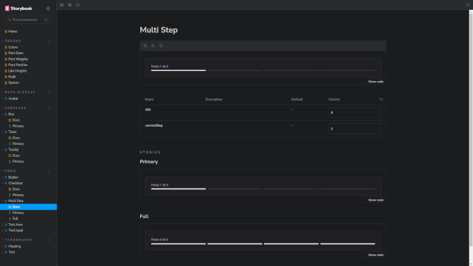

<h1 align="center"> Design System  </h1>

	The "Design System" study project is a as its name says a design system based on RadixUI and Stitches, this project features a bundle that has tokens, react components and documentation that is managed with Storybook.
  This is available through npm as @md-ignite-ui

  

 

  <h3 align='center'>Web</h3>
  

## ✅ Status

- Finished ✅

## 👨🏼‍💻 Functions

- Tokens
- React Components
- Documentation

## 🚀 Technologies

This project used the following technologies:

- Turbopack
- RadixUI
- Stitches 
- Phosphor-Icons
- Storybook
- Git e Github

## 💻 Project

This project was developed to solve the fifth challenge of Ignite's React track

## :memo: License

- Excluding the layout, this project is under the license GPL-3
